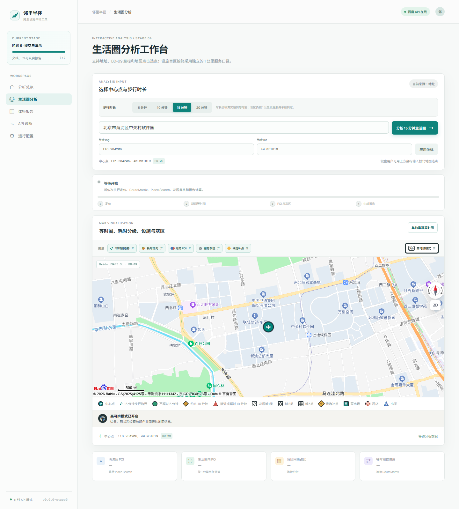

# 邻里半径 · 15 分钟生活圈

当前应用版本为 `0.6.0-stage6`，本工作区在其基础上完成参赛收口：保留 P1–P4 核心能力和 P7 开源交付，新增独立核验模板/计算器、RouteMatrix 多轮基准、七类故障证据、多源冲突审计和三分钟演示材料。P5 已补充确定性规划情景排序与前后情景估算，但真实选址、道路/用地核验、独立人工真值与正式发布信息仍待补齐。



## 快速开始

```bash
npm ci
npm run demo
```

## GitHub Pages 演示站

项目内置静态演示部署：真实百度地图 JSAPI GL + Mock 分析数据，不依赖 FastAPI 后端。首次启用、浏览器端 AK 白名单和仓库变量配置见 [`docs/github-pages.md`](docs/github-pages.md)。推送到 `main` 后，`.github/workflows/pages.yml` 会自动构建并发布。

打开 `http://127.0.0.1:4173`。`demo` 命令会强制使用仓库内固定样例，不需要 AK、FastAPI 或外网，也不会被本机 `.env.local` 覆盖。日常开发可使用 `npm run dev`。

环境要求：Node.js 22 或 24；在线后端需 Python 3.13；容器路径需 Docker Compose v2。

常用检查：

```bash
npm run lint
npm test
npm run test:e2e
npm run evidence:validate-template
npm run benchmark:route-matrix
npm run check:submission
npm run build
```

后端测试：

```powershell
cd backend
python -m unittest discover -s tests -p "test_*.py"
```

## 切换在线 API

复制 `.env.example` 为 `.env.local`，设置：

```ini
VITE_DATA_MODE=online
VITE_API_BASE_URL=/api
VITE_DEV_API_TARGET=http://localhost:8000
VITE_BAIDU_BROWSER_AK=你的浏览器端AK
```

后端复制 `backend/.env.example` 为本地环境配置，并设置服务端 AK：

```ini
BAIDU_SERVICE_AK=你的服务端AK
BAIDU_MAX_QPS=1
BAIDU_QPS_WINDOW_SECONDS=3.2
```

AK 与白名单必须匹配用途：

- `VITE_BAIDU_BROWSER_AK` 必须是浏览器端应用 AK，只用于 JSAPI GL 底图；开发环境在控制台加入 `localhost` 和实际访问域名的 Referer 白名单。它会随前端代码下发，不能代替服务端 AK。
- `BAIDU_SERVICE_AK` 必须是服务端应用 AK，用于 Web Service API；生产环境应配置部署出口 IP 白名单。它只能放在 `backend/.env` 或部署平台的服务端密钥中。

### 环境变量

| 变量 | 默认值 | 说明 |
| --- | --- | --- |
| `VITE_DATA_MODE` | `mock` | `mock` 或 `online` |
| `VITE_API_BASE_URL` | `/api` | 前端请求前缀 |
| `VITE_API_TIMEOUT_MS` | `180000` | 单次前端请求超时，需要覆盖严格 QPS 下的 P3 复核 |
| `VITE_DEV_API_TARGET` | `http://localhost:8000` | Vite 开发代理目标 |
| `VITE_BAIDU_BROWSER_AK` | 空 | 浏览器 JSAPI GL AK |
| `BAIDU_SERVICE_AK` | 空 | 后端 Web Service AK |
| `BAIDU_TIMEOUT_SECONDS` | `12` | 上游请求超时 |
| `BAIDU_RETRY_COUNT` | `1` | 可重试失败次数 |
| `BAIDU_MAX_CONCURRENCY` | `2` | 上游并发门控 |
| `BAIDU_MAX_QPS` | `1` | 滑动窗口内最大请求数 |
| `BAIDU_QPS_WINDOW_SECONDS` | `3.2` | QPS 窗口秒数 |
| `BAIDU_CACHE_TTL_SECONDS` | `300` | 内存缓存 TTL |
| `BAIDU_CACHE_MAX_ENTRIES` | `256` | 最大缓存项 |
| `BAIDU_CIRCUIT_FAILURE_THRESHOLD` | `4` | 熔断失败阈值 |
| `BAIDU_CIRCUIT_COOLDOWN_SECONDS` | `20` | 熔断冷却时间 |
| `MAX_ROUTE_DESTINATIONS` | `50` | RouteMatrix 每批终点上限 |
| `CORS_ALLOW_ORIGINS` | 本地 Vite 源 | 逗号分隔的允许源 |

启动后端：

```powershell
cd backend
uvicorn app.main:app --reload --port 8000
```

启动前端：

```bash
npm run dev
```

### Docker Compose

```bash
docker compose config --quiet
docker compose up --build
```

打开 `http://localhost:4173`。Compose 构建前端 Nginx 镜像和 FastAPI 镜像，Nginx 将 `/api` 反向代理到后端。未配置 `backend/.env` 时后端健康检查会明确显示 degraded，不伪造在线数据。

前端客户端约定以下接口：

| 能力 | 方法 | 路径 |
| --- | --- | --- |
| 健康检查 | GET | `/api/health` |
| 地理编码 | POST | `/api/v1/map/geocode` |
| 逆地理编码 | POST | `/api/v1/map/reverse-geocode` |
| 坐标转换 | POST | `/api/v1/map/coordinate-convert` |
| POI 检索 | POST | `/api/v1/map/poi/search` |
| POI 获取 + 盲区完整分析 | POST | `/api/v1/map/poi/analyze` |
| 盲区分析 | POST | `/api/v1/map/blind-spots` |
| 路线矩阵 | POST | `/api/v1/map/route-matrix` |
| 步行单路线与分段几何 | POST | `/api/v1/map/walking-route` |

成功响应必须为 `{ "ok": true, "data": {}, "meta": {} }`。客户端会为每个请求生成 `X-Request-ID`，并统一映射超时、网络错误、429 限流、服务错误和异常响应。`GET /api/health?verify=true` 会绕过缓存发起一次真实百度请求。

## 第四阶段主流程

1. 在“生活圈分析”中输入地址、BD-09 坐标，或直接点击地图选点。
2. 切换 5、10、15 或 20 分钟步行时长并启动分析。进度条会依次显示定位、路网等时圈、POI 与灰区、报告生成四个阶段。
3. 使用地图上方开关独立显示等时圈边界、耗时分级、分类 POI、1 公里服务灰区和候选灰区质心；默认开启高可辨模式，以线型、形状、纹理、`G` 编号和文字共同表达信息。真实分析优先按不重叠的原始盲点网格绘制灰区，避免半透明凸包重叠造成“颜色越深越严重”的误读。
4. 在“体检报告”中查看综合分、八类设施卡片、柱状图、雷达图、灰区清单、评分公式、数据时间、算法版本和降级限制。
5. 点击“下载 HTML”保存独立报告，或点击“打印 / 导出 PDF”使用浏览器的打印对话框生成 PDF。

默认 Mock 模式内置完整设施与灰区快照，可在没有服务端 AK 的环境中跑通整条演示流程。浏览器 AK 也未配置时，页面自动使用离线底图；在线模式仍使用真实百度 JSAPI GL。

## 当前阶段边界

已完成：P0 项目骨架与安全配置约定；P1 五类真实百度 Web Service 适配、超时重试、随机抖动、并发门控、滑动窗口 QPS 节流、TTL 缓存、熔断、配额计数和错误映射；P2 真实步行路网等时圈、分轮边界收敛和同源内部交叉复核；P3 多页 POI 拉取、分类清洗、去重、生活圈筛选、1 公里盲区和 RouteMatrix 边界复核；P4 地址/坐标/地图三种选点、时长切换、分阶段进度、五类地图图层、响应式报告、HTML/PDF 导出以及桌面/移动端 Playwright 主流程验收；P5.1–P5.3 确定性规划情景排序与前后覆盖估算；P6 比赛收口所需的多轮性能基线、故障注入、错误/降级状态和工程证据；P7 文档、CI、真实社区报告、固定演示、开源合规和三分钟演示脚本。

页面“生活圈分析”已接入真实百度 JSAPI GL 与离线底图，支持地址、坐标或地图点击选点，并展示分类 POI、等时圈、耗时热力、灰区和逐灰区证据。体检报告的评分由版本化确定性规则生成；候选点已接入 P5 确定性优先级和有边界的覆盖情景估算，但候选质心不是正式选址，规划前后改善量也不是实测结论。

范围边界：本轮新增的是 `planning-scenario-v1` 确定性情景排序，不是道路网络、用地、入口和服务半径约束下的真实选址算法；候选质心不等于选址结论，覆盖改善量是上限情景估算。在线等时圈失败后若半径分析可继续，页面明确标为 `degraded`；否则保持 `error`。系统不会把在线失败静默切换成固定样例。在线逐点/批量同环境基准仍待授权 AK 环境运行。

服务端 AK 不进入前端环境变量、页面日志、样例数据或 Docker 前端构建参数；只有浏览器地图 SDK AK 才允许使用 `VITE_BAIDU_BROWSER_AK`。独立发布前还必须对新仓库完整 Git 历史执行 Gitleaks，当前不预先宣称远程历史已通过。

## P2 等时圈引擎

第二阶段已完成：

- 以 BD-09 中心点生成 36 方向、5 档距离的极坐标候选点，RouteMatrix 请求按 50 个终点分批。
- 在 900 秒目标附近按轮次重新测量候选边界；以 60 秒时间误差或 50 米空间区间为停止条件，超出初始搜索范围时受控向外扩展。
- 相邻方向半径差异超过 30% 时增加方向采样，最多 72 个方向；加密方向也执行相同的边界收敛。
- 对失败方向做相邻方向插值，对异常尖峰做离群修复，并在必要时用凸包保证 GeoJSON 不自交。
- 对主方向、均匀方向和局部凹陷最多抽取 12 个边界点，先用 DirectionLite 的步骤几何截取目标时刻，再以 RouteMatrix 分轮校准并做同源内部交叉复核；复核通过率参与置信度判定并写入报告，独立人工误差另由核验数据集计算。
- 输出 GeoJSON Polygon、逐样本热力数据、批次数量、迭代轮次、复核通过率、置信度和限制说明。
- 测试覆盖圆形空旷路网、河流阻隔、道路绕行、非线性路网、不可收敛跳变和局部 API 失败夹具。

## P4 端到端验收

`npm run test:e2e` 会强制使用 `.env.e2e` 的离线样例模式，在真实 Chromium 中分别以桌面和手机视口验证地图选点、时长切换、完整分析进度、边界复核证据、图层开关、报告图表、HTML 下载和无横向溢出。单条流程同时检查在 3 分钟内完成。

2026-09-13 的真实边界、QPS 指标和桌面/移动端结果记录在 [`docs/acceptance-stage2-stage4.md`](docs/acceptance-stage2-stage4.md)。

在线模式下，“获取真实 POI 并分析盲区”会先执行 P2 等时圈，再将真实边界传给 P3 做生活圈设施筛选。若 RouteMatrix 暂时失败，P3 会明确降级为 1 公里半径筛选，不会伪造等时圈。

## P3 真实分析说明

- 检索中心周边 2 公里，使用最多 10 个民生关键词和最多 8 页结果；本地再次做范围校验。
- 读取百度 `classified_poi_tag`，按词典标准化为医疗、教育、购物、养老等类别；先按 `uid` 去重，无 `uid` 时按标准化名称和 50 米距离去重。
- 菜市场、药店和小学按 1 公里设施服务阈值分析候选网格，接近阈值的网格最多抽取 20 个用 Walking RouteMatrix 复核。
- 每个灰区返回缺失类别、连续网格数、面积、人口代理、设施计数和边界候选数；页面直接展示这些证据。

浏览器 AK 必须是“浏览器端”应用类型，并在百度控制台为实际访问域名（开发环境通常为 `localhost`）配置 Referer 白名单。服务端 AK 必须是“服务端”应用类型并配置部署出口 IP 白名单。

## 参赛收口交付导航

| 交付物 | 文件 |
| --- | --- |
| 技术设计 | [`docs/technical-design.md`](docs/technical-design.md) |
| 真实社区报告 | [`docs/real-community-report.md`](docs/real-community-report.md) |
| 固定演示数据 | [`docs/demo-data.md`](docs/demo-data.md) |
| 3 分钟演示脚本 | [`docs/demo-script.md`](docs/demo-script.md) |
| 最终提交清单 | [`docs/submission-checklist.md`](docs/submission-checklist.md) |
| 第六阶段验收 | [`docs/acceptance-stage6.md`](docs/acceptance-stage6.md) |
| 参赛收口最终门禁 | [`docs/acceptance-competition-final.md`](docs/acceptance-competition-final.md) |
| 第三方许可清单 | [`THIRD_PARTY_NOTICES.md`](THIRD_PARTY_NOTICES.md) |
| 工程优化基准与故障矩阵 | [`docs/engineering-evidence.md`](docs/engineering-evidence.md) |
| 多源 POI 清洗与许可策略 | [`docs/multi-source-poi-strategy.md`](docs/multi-source-poi-strategy.md) |
| 未完成任务与发布收口清单 | [`docs/unfinished-tasks.md`](docs/unfinished-tasks.md) |
| 发布收口执行开发者提示词 | [`docs/developer-prompt-for-completion.md`](docs/developer-prompt-for-completion.md) |
| CI | [`.github/workflows/ci.yml`](.github/workflows/ci.yml) |

GitHub Actions 只会读取仓库根目录下的 `.github/workflows`。发布比赛仓库时，请将当前 `baidumap` 目录的内容作为独立仓库根目录。

当前开发目录位于多项目父仓库中，不能直接把父仓库发布为比赛仓库。独立复制、根目录校验、密钥/历史扫描和人工授权边界见 [`docs/repository-release.md`](docs/repository-release.md)；比赛平台、截止时间、仓库/演示 URL 与团队信息统一在 [`docs/submission-metadata.md`](docs/submission-metadata.md) 保持“待填写”。发布副本初始化 Git 后运行：

```bash
npm run check:repository -- --require-independent-root
```

## 常见问题

### 页面只有离线底图

这是浏览器 AK 为空或 Referer 白名单不匹配时的预期行为。离线模式仍可完成全流程；在线模式请检查 `VITE_BAIDU_BROWSER_AK` 与当前域名白名单。

### 页面显示“后端已启动，但未配置 AK”

将服务端 AK 写入 `backend/.env` 的 `BAIDU_SERVICE_AK`，重启 FastAPI，再访问 `/api/health?verify=true`。不要把服务端 AK 写入任何 `VITE_` 变量。

### 在线分析很慢或出现 429

项目会优先保护上游配额。按百度控制台的真实配额调整 `BAIDU_MAX_QPS`、`BAIDU_QPS_WINDOW_SECONDS` 和并发数，不要随意放宽。演示现场使用 `npm run demo`。

### Playwright 提示没有浏览器

```bash
npx playwright install --with-deps chromium
npm run test:e2e
```

Windows 本机已安装 Chrome 但 Playwright Chromium 未安装时，仍建议用上述命令安装锁定的测试浏览器。

### Docker Compose 启动但 API 不可达

先运行 `docker compose config --quiet`，再检查 `backend/.env`、`CORS_ALLOW_ORIGINS` 与 8000/4173 端口占用。容器页面通过同源 `/api` 访问后端，无需把容器内服务名暴露到浏览器。
