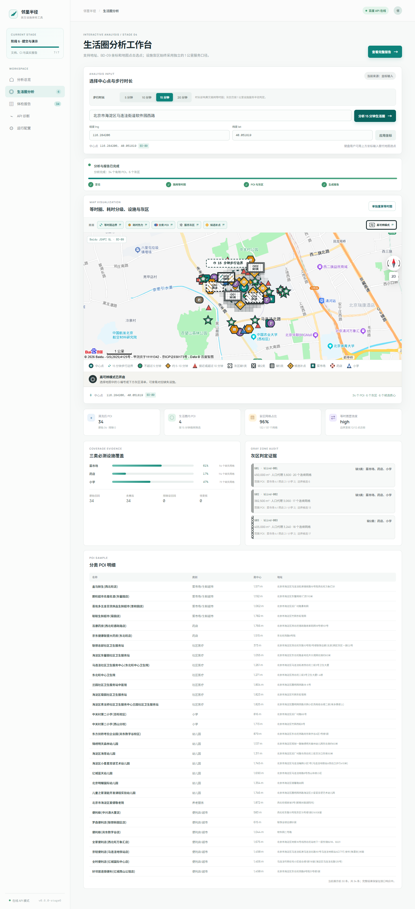
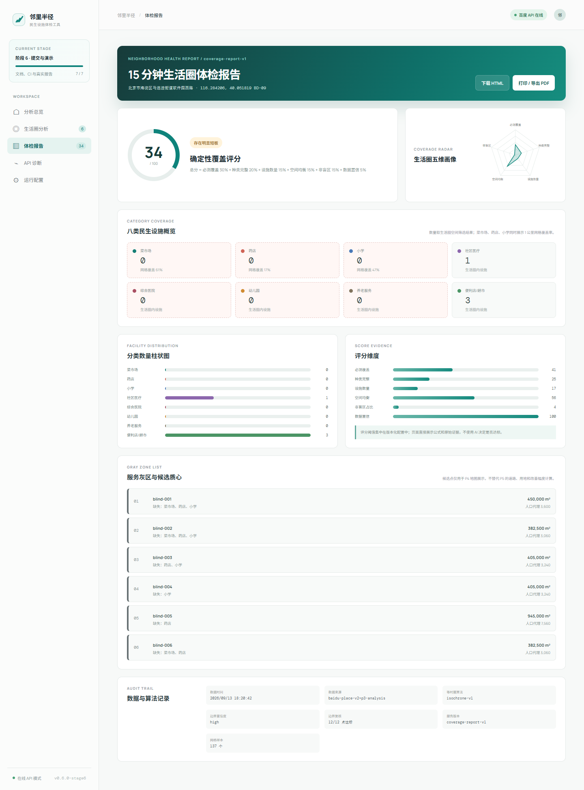

# 真实社区体检报告：北京海淀马连洼样本点

报告版本：`real-community-2026-09-13-v2-structure`
采集日期：2026-09-13
中心点：`116.284206, 40.051819` BD-09
逆地理编码：北京市海淀区马连洼街道软件园西路附近

## 1. 证据范围

本报告使用真实百度地图 Web Service API，且与离线演示数据分开归档：

- P2 等时圈：同一中心点、同一日执行的真实 Walking RouteMatrix + DirectionLite 验收。
- P3 POI/灰区：2026-09-13 16:31（中国标准时间）开始的真实 Place Search 与边界 RouteMatrix 复核。
- P3 请求 ID：`stage6-real-report-20260913`。
- 在线连通性：`GET /api/health?verify=true` 返回 `baiduReachable=true`。

报告不保存任何 AK，不抓取百度地图网页，不把测试日之外的 POI 状态推断为当前事实。

> 独立真值状态：**待采集**。本报告下列在线结果来自百度 API 与项目内部复核链，不等同于政府名录、机构官方记录、电话或实地记录。当前不得据此声明 POI 查全率、分类准确率或灰区准确率/召回率。



## 2. 参数

| 参数 | 值 |
| --- | ---: |
| 等时圈目标 | 900 秒 |
| 边界耗时容差 | ±60 秒 |
| 初始方向 | 36 |
| 最大方向 | 72 |
| POI 检索半径 | 2,000 米 |
| 灰区分析半径 | 1,000 米 |
| 灰区网格间距 | 150 米 |
| 边界路网复核上限 | 20 个网格 |
| 人口代理密度 | 8,000 人/平方公里 |

## 3. 真实步行边界

| 指标 | 结果 |
| --- | ---: |
| 有效 RouteMatrix 样本 | 274 / 274 |
| 自适应新增方向 | 2 |
| 单路线几何截点 | 12 / 12 |
| 沿路线复核校准 | 2 轮 |
| 最终内部 RouteMatrix 复核 | 12 / 12 通过 |
| 复核耗时范围 | 845–913 秒 |
| 置信度 | high |
| 冷启动耗时 | 91 秒 |

12 个由同一百度路线体系执行的内部复核点全部落在 840–960 秒验收窗口内。这只证明本次系统内抽样边界符合目标，不构成独立人工真值，也不代表 Polygon 内每个位置都已穷举验证。详细运行记录见 [阶段 2–4 验收](acceptance-stage2-stage4.md)。

## 4. 真实 POI 与质量统计

| 指标 | 结果 |
| --- | ---: |
| 上游报告总数 | 34 |
| 拉取页数 | 2 |
| 原始/标准化/去重后 | 34 / 34 / 34 |
| 算法排除 | 0 |
| `needs_review` | 0 |
| 2 公里检索区内 | 34 |
| 1 公里分析区内 | 6 |

2 公里搜索区的归类结果：

| 类别 | 数量 |
| --- | ---: |
| 菜市场/生鲜超市 | 4 |
| 药店 | 2 |
| 社区医疗 | 7 |
| 综合医院 | 0 |
| 小学 | 2 |
| 幼儿园 | 7 |
| 养老服务 | 1 |
| 便利店/超市 | 11 |

1 公里分析区内共 6 条：社区医疗 1、小学 1、幼儿园 1、便利店/超市 3；本次独立 P3 采集没有传入等时圈 Polygon，因此这一列明确使用 1 公里几何半径，不冒充 15 分钟路网范围。

随后的完整前端流程将 P2 Polygon 传给 P3，页面显示 4 条生活圈内 POI，筛选方式为 `polygon`。两个数字口径不同，所以分开报告。

## 5. 三类必测设施覆盖

| 类别 | 覆盖网格 | 缺失网格 | 覆盖率 |
| --- | ---: | ---: | ---: |
| 菜市场 | 83 / 137 | 54 | 60.58% |
| 药店 | 23 / 137 | 114 | 16.79% |
| 小学 | 64 / 137 | 73 | 46.72% |

- 任一必测类别缺失的网格：132 / 137。
- 聚合灰区：6 个。
- 边界候选网格：97 个；受请求上限约束，抽取 20 个执行 RouteMatrix 复核，20 / 20 成功。
- 本次 P3 调用耗时 69,618 ms；运行时累计上游调用 32 次，自动限速等待 25 次/22,302 ms，无重试、无最终错误、熔断器未打开。

## 6. 灰区摘要

| 灰区 | 缺失类别 | 连续网格 | 面积 m² | 人口代理 |
| --- | --- | ---: | ---: | ---: |
| blind-001 | 菜市场、药店、小学 | 20 | 450,000 | 3,600 |
| blind-002 | 菜市场、药店、小学 | 17 | 382,500 | 3,060 |
| blind-003 | 药店、小学 | 18 | 405,000 | 3,240 |
| blind-004 | 小学 | 18 | 405,000 | 3,240 |
| blind-005 | 药店 | 42 | 945,000 | 7,560 |
| blind-006 | 菜市场、药店 | 17 | 382,500 | 3,060 |

面积是网格面积汇总，人口代理是配置密度乘以面积，两者都不是精细地块或人口普查结果。本阶段不对灰区生成规划优先级、新设施选址或改善百分比。



页面报告的确定性覆盖评分为 34/100，状态为“存在明显短板”。八类设施卡片严格按 P2 Polygon 内的 4 条 `serviceAreaPois` 计数（社区医疗 1、便利店/超市 3），不再混用 2 公里检索区的 34 条分类总数。评分是本项目的版本化规则输出，不是政府公式或规划审批结论。

## 7. 独立人工核验指标

数据集状态：`候选工作包已建立，完整核验待完成`
数据时间：`2026-09-15（公开来源筛查时间；不是实地采集完成时间）`
独立来源：`政府公开名录 / 机构官方页面；官方电话记录与实地记录待补`
样本置信标签：`not-assessed`

| 指标 | 样本量 | 结果 | 当前限制 |
| --- | ---: | ---: | --- |
| POI 查全率 | 0 条最终 verified / 最低 30 | 不可计算 | 已索引 31 条来源候选并预填 7 条，但尚无人工签核真值 |
| 分类准确率 | 0 条最终 verified | 不可计算 | 8 条系统 POI 已预填来源线索，人工核验尚未完成 |
| 边界耗时绝对误差 | 0 / 最低 12 | 不可计算 | 当前 12 点为同源内部复核 |
| 灰区准确率 | 0 / 计划 12 | 不可计算 | 灰区分层真值尚未录入 |
| 灰区召回率 | 0 / 计划 12 | 不可计算 | 灰区分层真值尚未录入 |

可审计工具已经就绪：`data/validation/` 提供 30 条 POI（三类各 10 条）、12 条边界和 12 条灰区待填槽位；`backend/scripts/community_validation.py` 在数据不完整或真值来源是百度 Place Search 时拒绝生成准确率。参数集中在 `config/evidence-parameters.v1.json`。

2026-09-15 批量公开来源筛查工作包位于 `data/validation/candidates/2026-09-15-malianwa-v1/`。其中 `candidate-source-index.csv` 保存 31 条筛查轨迹，明确区分范围内候选、范围外记录、历史来源、位置未知和名称冲突；它不是 31 条真值。`COLLECTION_STATUS.md` 列出剩余人工动作和数据提升条件。

模板结构检查与完整数据计算命令：

```bash
npm run evidence:validate-template
python backend/scripts/community_validation.py calculate --input path/to/collected-data --output artifacts/validation-metrics.json
```

### 人工核验方法与当前状态

提交前人工核验采用下列方法：

1. 先从政府名录和机构官方来源建立独立候选清单，再与系统的 34 条返回做匹配；不得只从系统返回反推查全率分母。最终真值不少于 30 条，菜市场、药店、小学各不少于 5 条。
2. 通过设施官方电话/官网、政府公开名录或实地记录确认名称、类别、地址和营业状态；不以同一个百度 POI 返回作为独立真值。
3. 抽取至少 12 个边界方向，使用与系统计算链独立的人工记录或经说明的官方路线证据，记录耗时、入口偏移和道路阻隔；同一百度 RouteMatrix 返回不能自证为独立真值。
4. 对每个灰区抽取内部与边缘网格，人工判定三类设施是否真的缺失，再计算准确率/召回率。

本轮已完成 API 真实采集、结构审计、系统内部算法复核、模板、校验器、计算器、合成单测和第一轮公开来源候选筛查；尚未完成 30 条 POI、12 条边界和 12 条灰区分层样本的人工签核与实地核验。因此本报告不声称上述指标已有地面真值。

## 8. 误差案例与限制

当前没有可发布的独立人工误差案例；下列是在线运行中已观察到的系统限制与待核验风险，不能冒充地面真值误差：

- 同一地址可能以“社区卫生服务中心”和“中心卫生院”两个不同 `uid` 返回；当前 `uid` 优先去重不会合并这类语义重复。
- Place Search 返回 0 个综合医院不等于现实中不存在医院；可能受关键词、分类、半径和数据时效性影响。
- P3 的 97 个边界候选只复核 20 个，剩余网格仍使用球面距离初筛。
- 封闭小区出入口、施工、楼内通道和 POI 入口偏移会改变真实步行耗时。
- POI 采集时间是数据快照时间，不证明营业状态。
- 在线整页流程受严格 QPS 保护影响。首次冷流程在约 105 秒进入 P3，随后因旧的前端 60 秒单请求超时而在总计 166 秒显示“分析失败，可安全重试”。新环境默认值已调整为 180 秒；后端完成并写入缓存后，原参数重试在 4 秒内完成，上方两张截图来自该真实在线重试。缓存重试耗时不能代表冷启动性能。

## 9. 结论

本次真实数据说明：边界抽检能在 900 ± 60 秒内闭环；按当前 1 公里服务口径，药店和小学的网格覆盖显著低于菜市场。这些是体检证据，不是规划建议。在完成独立 POI 地面真值和入口/用地核验前，不应据此直接确定新建设施位置。
